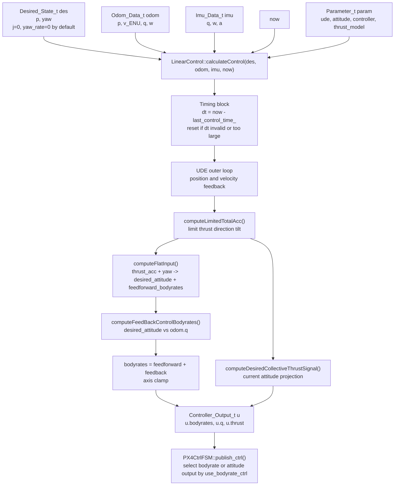
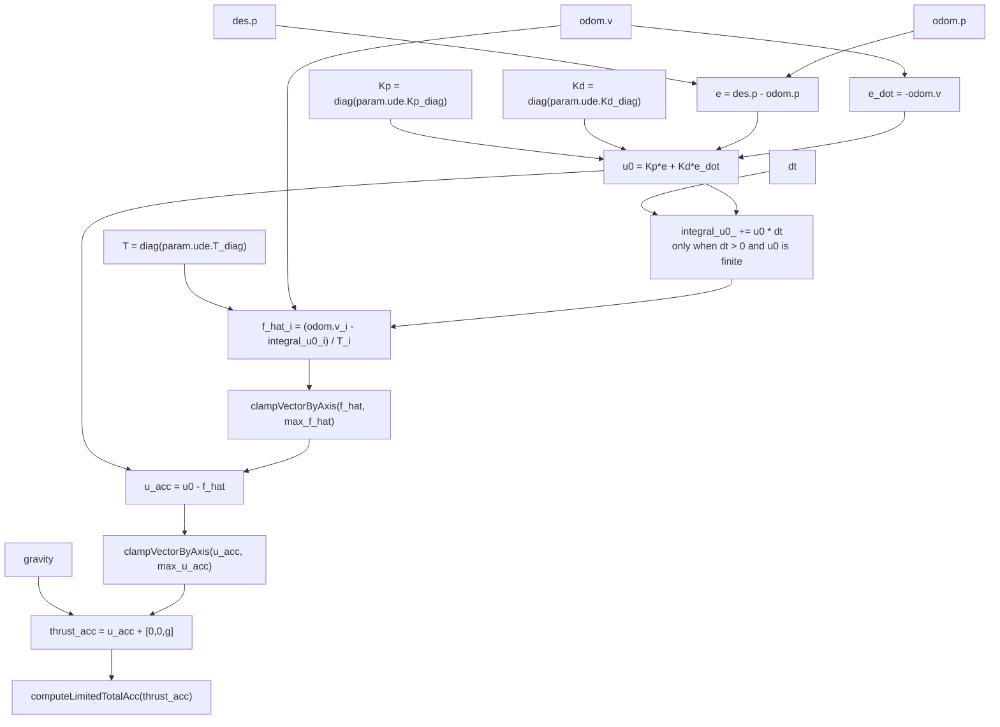
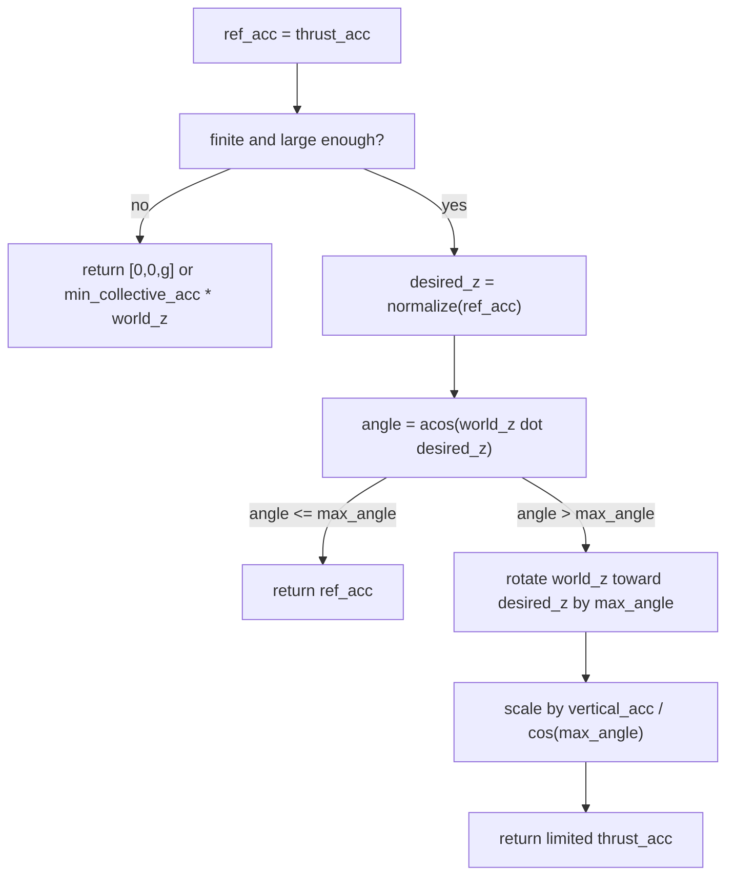
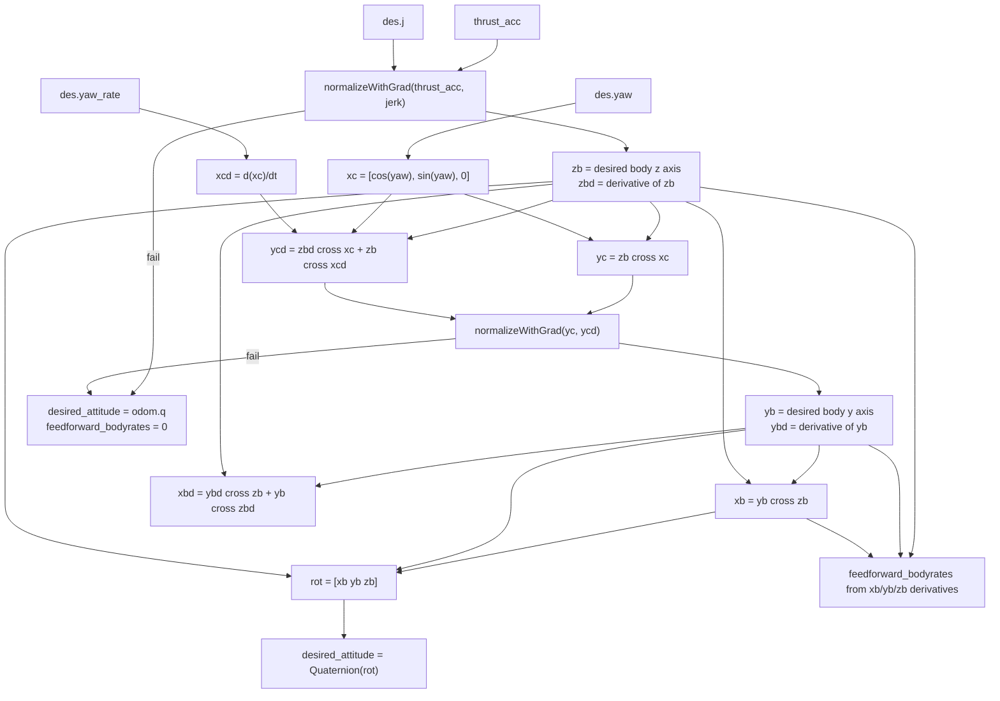
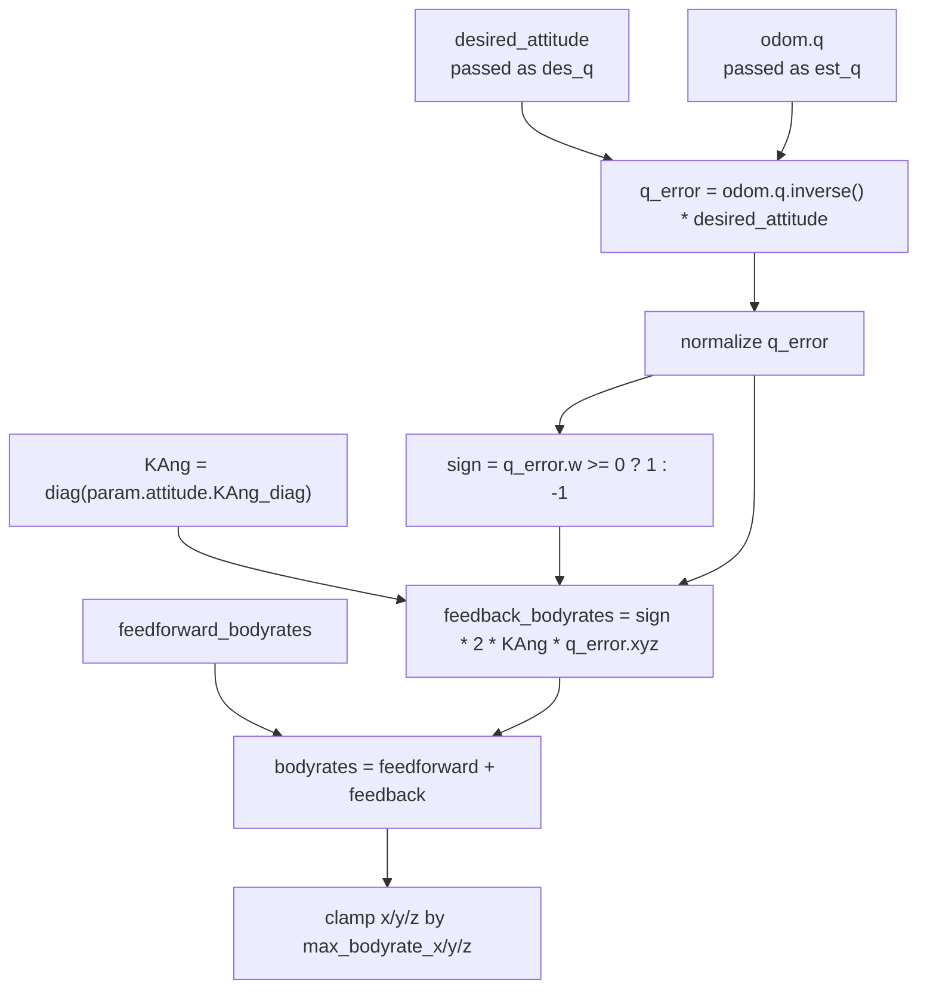
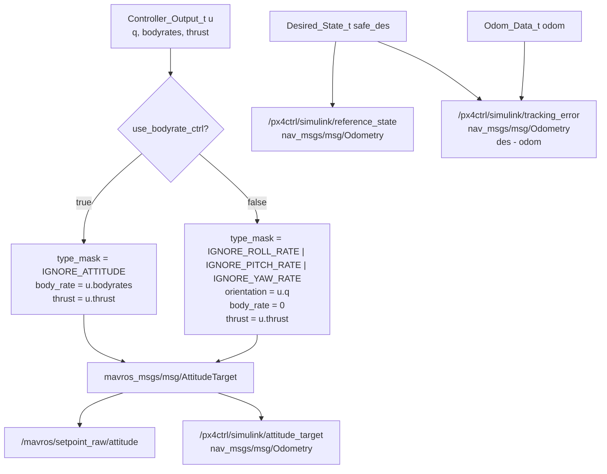
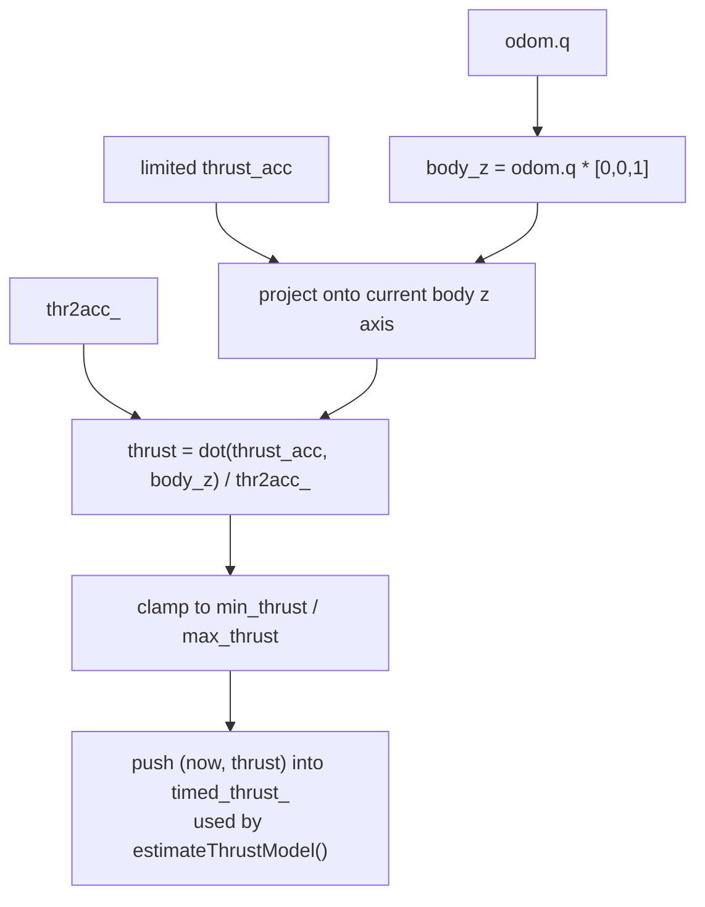
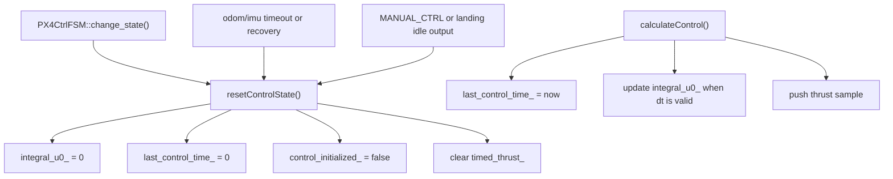

# PX4Ctrl UDE Bodyrate / Attitude Controller Data Flow

This document describes the current ROS2 controller data flow in:

- `src/controller.cpp`
- `src/controller.h`

The main entry point is:

```cpp
Controller_Output_t LinearControl::calculateControl(
  const Desired_State_t &des,
  const Odom_Data_t &odom,
  const Imu_Data_t &imu,
  const rclcpp::Time &now)
```

The controller output computed by `calculateControl()` is:

```text
bodyrates = [p_rate, q_rate, r_rate]
q         = desired attitude quaternion
thrust    = normalized collective thrust
```

PX4 receives `mavros_msgs/msg/AttitudeTarget` on `/mavros/setpoint_raw/attitude`.
The final setpoint mode is selected by `use_bodyrate_ctrl`:

```text
true  -> body_rate + thrust, IGNORE_ATTITUDE
false -> orientation + thrust, IGNORE_ROLL_RATE | IGNORE_PITCH_RATE | IGNORE_YAW_RATE
```

The same setpoint is also mirrored for Simulink as a standard
`nav_msgs/msg/Odometry` on `/px4ctrl/simulink/attitude_target`:

```text
pose.pose.orientation = commanded quaternion
twist.twist.angular   = commanded body_rate
twist.twist.linear.x  = normalized thrust
twist.twist.linear.y  = AttitudeTarget type_mask
twist.twist.linear.z  = output mode, 1 bodyrate, 0 attitude
```

For Simulink reference/actual tracking diagnostics, px4ctrl also publishes
standard topics:

```text
/px4ctrl/simulink/reference_state
  pose.pose.position = desired position used by the controller
  pose.pose.orientation = desired yaw as quaternion
  twist.twist.linear = desired velocity
  twist.twist.angular.z = desired yaw_rate

/px4ctrl/simulink/actual_state
  pose.pose.position = odom position used by the controller
  pose.pose.orientation = odom attitude
  twist.twist.linear = odom velocity in the controller/world frame
  twist.twist.angular = odom angular velocity

/px4ctrl/simulink/tracking_error
  pose.pose.position = desired position - odom position
  pose.pose.orientation = desired yaw - odom yaw as quaternion
  twist.twist.linear = desired velocity - odom velocity
  twist.twist.angular.z = desired yaw_rate - odom yaw_rate

/px4ctrl/simulink/ude_debug
  nav_msgs/Odometry packing key UDE debug values into scalar fields

/px4ctrl/ude_tune
  std_msgs/Float64MultiArray for online Kp/Kd/T tuning only
```

See `simulink_reference_actual_topics.md` for the complete field mapping.

## Top Level Flow



## UDE Outer Loop

This replaces the old `computePIDErrorAcc()` path.



Old controller comparison:

```text
old:
  pid_error_acc = computePIDErrorAcc(odom, des, param)
  total_acc = pid_error_acc + des.a + gravity

current:
  u0 = Kp*e + Kd*e_dot
  f_hat = T^-1 * (odom.v - integral_u0)
  u_acc = u0 - f_hat
  thrust_acc = u_acc + gravity
```

## Tilt Limit



`computeLimitedTotalAcc()` limits the direction of the requested thrust vector.
It does not use the old roll/pitch small-angle equations.

## Flat Input To Desired Attitude

`computeFlatInput()` is where `desired_attitude` is computed.



Important notes:

- `desired_attitude` is initialized to `odom.q` before calling
  `computeFlatInput()`.
- On success, `computeFlatInput()` overwrites it with `Quaternion(rot)`.
- On failure, the controller keeps `desired_attitude = odom.q` and sets
  feedforward bodyrates to zero.

## Bodyrate Feedback



## Setpoint Publishing



Variable mapping:

```text
computeFeedBackControlBodyrates(des_q, est_q)

des_q = desired_attitude
est_q = odom.q
```

## Thrust Mapping



This is different from the old `des_acc.z / thr2acc` mapping. The current
mapping uses the current attitude projection:

```text
thrust = dot(thrust_acc, current_body_z) / thr2acc
```

## Runtime State Variables



Mode switching effect:

- `AUTO_TAKEOFF -> AUTO_HOVER` resets UDE state.
- `AUTO_HOVER -> CMD_CTRL` resets UDE state.
- `CMD_CTRL -> AUTO_HOVER` resets UDE state.
- Feedback timeout and recovery also reset UDE state.

Therefore `integral_u0_` is not shared across these mode transitions.

## Short Function Map

```text
calculateControl()
  dt / reset guard
  UDE outer loop
    diagVector()
    clampVectorByAxis()
  computeLimitedTotalAcc()
  computeFlatInput()
    normalizeWithGrad()
  computeFeedBackControlBodyrates()
    diagVector()
  computeDesiredCollectiveThrustSignal()
  update timed_thrust_

estimateThrustModel()
  consumes timed_thrust_
  consumes imu.a
  updates thr2acc_
  rejects out-of-range imu.a.z / thrust samples
  limits each thr2acc_ update step to avoid sudden thrust-model jumps
```
